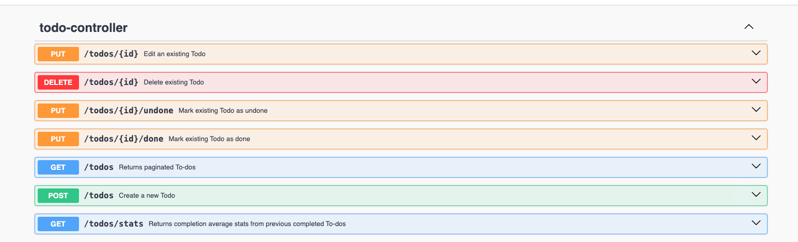

# Todo App

Implementation of a simple yet useful application
for organizing incoming activities. This repo includes a client agnostic API Rest created using Spring Boot. 

## Table of Contents

- [Caveats](#caveats)
- [Endpoints](#endpoints)
- [Features](#features)
- [Prerequisites](#prerequisites)
- [Installation](#installation)
- [Usage](#usage)
- [Testing](#testing)
- [Contributing](#contributing)

## Caveats
This application is using in-memory storage for data. No persistence layer is configured.

## Endpoints

These are the endpoints implemented by the current version of the project.



## Features

- Create Todo (Text, Priority, Due Date)
- Update Todo (Text, Priority, Due Date)
- Update Todo Status (Done/Undone)
- Delete Todo
- Get Todos (Paginated, Sorted and Filtered)

## Prerequisites

There's no need for an specialized IDE for this project. 
However, since the development was done using IntelliJ IDEA, using it
is super recommendable. 

The needed software to run this project is:

- OpenJDK 17+
- Maven 3.9+


## Installation

Please be sure that you have the software requirements as [Prerequisites](#prerequisites) says.

Instructions to get your project up and running locally (UNIX-like systems):
1. Clone Repo
```bash
git clone https://github.com/ernestorbemx/TodoApp.git
```
2. Change directory to the cloned project folder
```bash
cd TodoApp
```
3. Run maven script
```bash
./mvnw spring-boot:run
```
4. Navigate to `http://localhost:9090/swagger-ui/index.html#/`
5. Done!

## Usage

This is a simple REST API. You can use your favourite 
HTTP client to start using it.


## Testing

After following [this instructions](#installation), you can run the script:

```bash
    ./mvnw test
```

## Contributing
Contributions are welcome! For requesting changes, first open an issue.

When developing changes, please:
1. Fork the repo
2. Create your feature branch (git checkout -b feature/FeatureName)
3. Commit your changes (git commit -m 'Add some feature')
4. Push to the branch (git push origin feature/FeatureName)
5. Open a Pull Request


